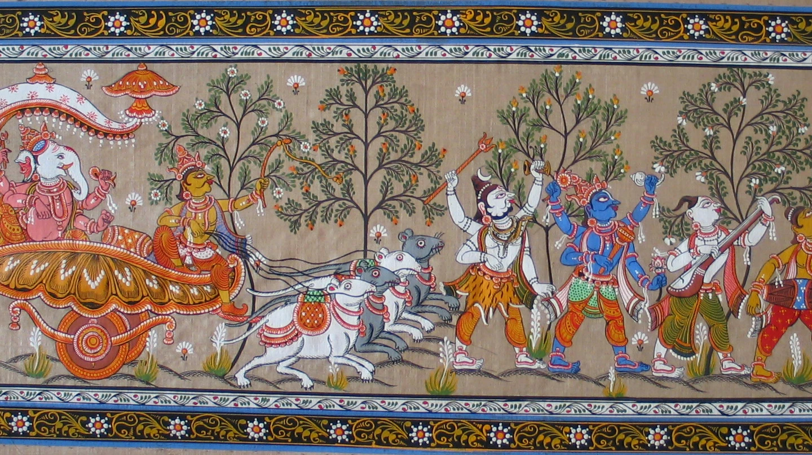

  

<body style="background-color:#FEF9E7;"></body>
  
###### *The procession of Ganesha.*   *(left to right) Ganesha, Kartikeya, Shiva, Vishnu, Narada Muni and musician.*  
 

# Angad Sahni 

### [Curriculum Vitae](pdfs/CV.pdf) 
**Email:** a.sahni@pgr.reading.ac.uk 
  
Neuroscience PhD student, 
[Neuroscience of Reward Group (NRG)](https://www.nrg-lab.co.uk/),  
University of Reading. 
**Started:** September, 2021  
**Completed:** - 
 
 

  
## Publications

### 2022
Deterioration in cognitive control underlying development of treatment resistance in early psychosis.  
(CSI lab; submitted for publication)
 
 
*- April*
 
[The role of cognitive control in the positive symptoms of psychosis.](https://doi.org/10.1016/j.nicl.2022.103004)   
([CSI lab](http://www.csilab.org/), King's College London) 

  
  

## Contents 
### PhD

1. [Reward vs. Effort Learning Task](task.md)  
2. [Experience Sample Methodology (ESM) Study](esm1.md)  
3. [Outreach](outreach.md)  

### Personal Project

1. [WTF Even Is Spirituality??](personal/main.md)  

