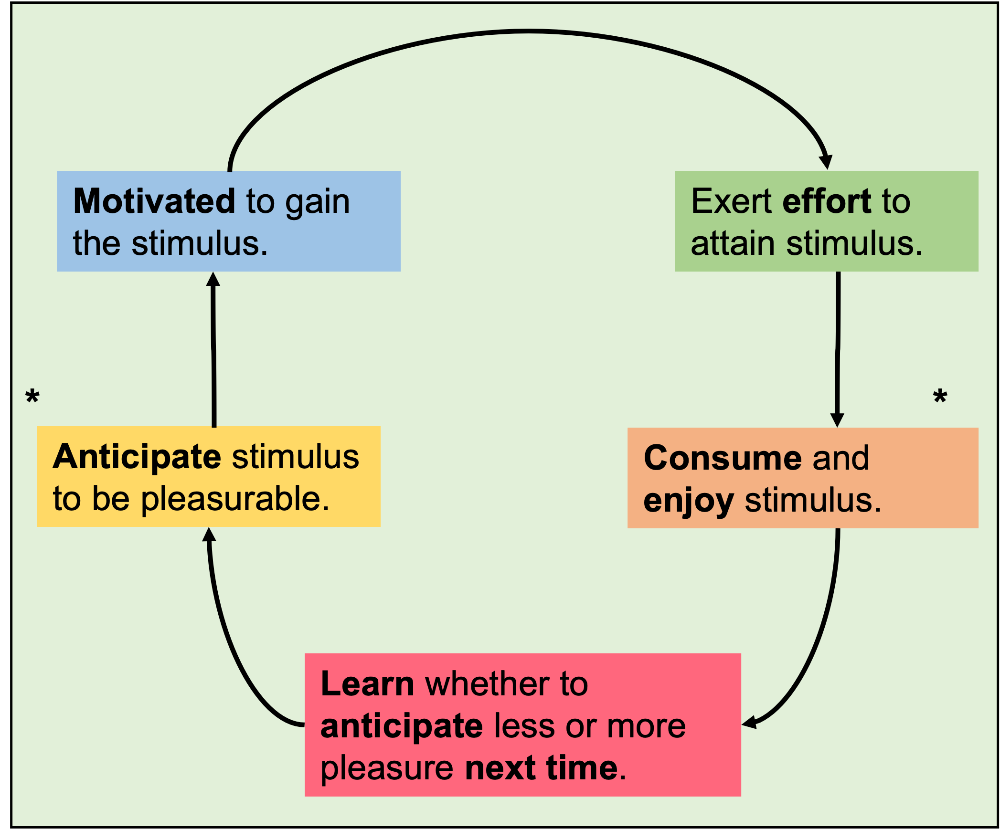

<h1 align="center"> Home </h1> 

<iframe src="https://reading.onlinesurveys.ac.uk/contact_survey1" width="620" height="500"></iframe>

 
 

### [Curriculum Vitae](https://angadsahni93.github.io/pdfs/CV.pdf)
**Email:** <a href= "mailto: a.sahni@pgr.reading.ac.uk">a.sahni@pgr.reading.ac.uk</a> 
 
 
Neuroscience PhD student, 
[Neuroscience of Reward Group (NRG)](https://www.nrg-lab.co.uk/),  
University of Reading. 
**Started:** September, 2021  
**Completed:** - 
 
 
Skip to my research currency: [Publications](README.md#publications). I assure you, you won't be impressed.
 
 

## About Me
**Under construction**.

  
  The Temporal Experience of Pleasure (TEP) cycle by <a href="https://www.ncbi.nlm.nih.gov/pmc/articles/PMC4020953/">Kring and Barch</a> is the bedrock of my PhD on anhedonia.
  

<!-- My first degree was an integrated-MSc in Neuroscience from UCL. -->

 
 

## Publications

### 2022
**Deterioration in cognitive control underlying development of treatment resistance in early psychosis.**  
**Authors:** Charlotte M Horne, Angad Sahni, Sze W Pang, Lucy D Vanes, Timea Szentgyorgyi, Bruno Averbeck, Rosalyn J Moran, Sukhwinder S Shergill. 
[CSI lab](http://www.csilab.org/); submitted for publication
 
 

**[The role of cognitive control in the positive symptoms of psychosis.](https://doi.org/10.1016/j.nicl.2022.103004)**  
**Authors:** Charlotte M.Horne, Angad Sahni, Sze W.Pang, Lucy D.Vanes, Timea Szentgyorgyi, Bruno Averbeck, Rosalyn J.Moran, Sukhwinder S.Shergill.  
[CSI lab](http://www.csilab.org/), King's College London

   
   
   
   
   
   
