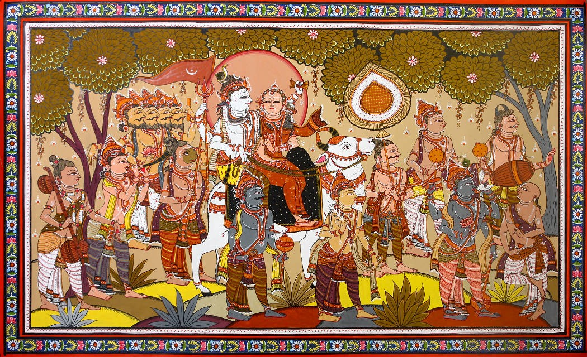

###### *The procession of Ganesha.*   *(left to right) Ganesha, Kartikeya, Shiva, Vishnu, Narada Muni and musician.*
 

# Angad Sahni  
### [Curriculum Vitae](CV.pdf)  
**Email:** a.sahni@pgr.reading.ac.uk   

Neuroscience PhD student in the [Neuroscience of Reward Group (NRG)](https://www.nrg-lab.co.uk/),  
University of Reading. 
    

## Contents  
- [Reward vs. Effort Learning Task](task.md)  
- [Experience Sample Methodology (ESM) Study](esm1.md)

