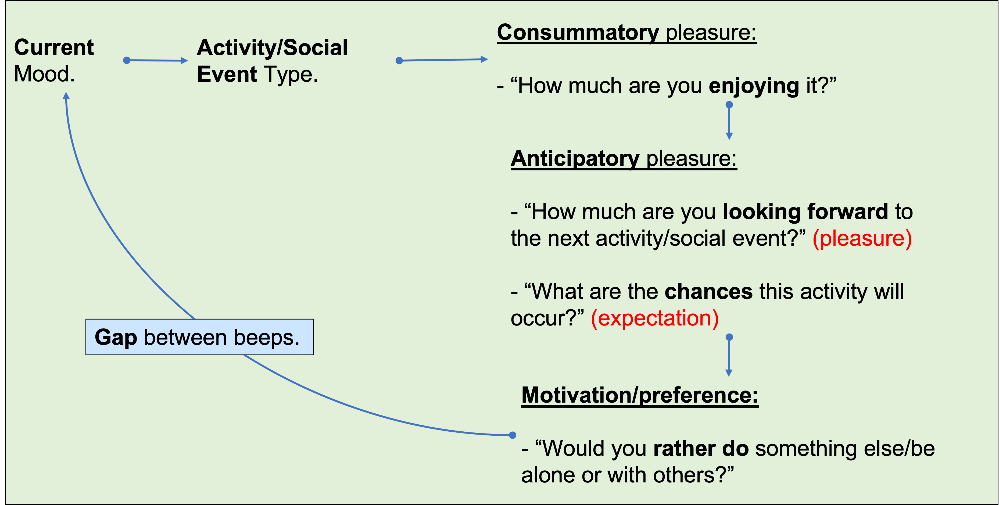

<h1 align="center"> Experience Sampling Methodology (ESM) Study </h1>

## Contents
1. [Design](esm1.md#design)  - [Background](esm1.md#background)  - [NRG's Modifications](esm1.md#nrgs-modifications)  
2. [Recruitment](esm1.md#recruitment)  - [Strategy](esm1.md#strategy)  - [Issues & Solutions](esm1.md#issues--solutions)  

## Design
#### Background
Our study is a replication of the [Edwards et al. (2018)](https://www.ncbi.nlm.nih.gov/pmc/articles/PMC6294730/) paper. It investigates the relationship between anticipatory and consummatory pleasure in the **real world**. Answering short questionnaires pertaining to said topics during the day means the responses are **ecologically valid**. This is a novel and exciting development in research as it helps us examine how clinical symptoms manifest themselves in the **processing** of the real world! When has this ever been done before?!

The group conducted their study in schizophrenic and healthy participants, where both groups answered short questionnaires that "beeped" **7 times a day, for 6 days**, on a [PsyMate](https://www.psymate.eu/) device. The questions are shown in Figure 1. 
 
 
 

  
  Figure 1: Flowchart showing the questionnaire that is repeated 7 times a day for 6 days. Referred to as the BEEP questionnaires, as the reminders were labelled beeps.

 
 

The **'current mood'** item contains 11 questions, all of them rated using a **1 (least) to 7 (most) Likert scale**. Questions began with 'Are you' and included affective measures like cheerful, anxious and lonely. 
The **activity and social event** question gave options to select from. 
All of the other questions were also answered using a 1-7 Likert scale, with the exception of the **'expectation'** question; participants were required to use a **sliding scale** and rate it between **0-100%**. 
Lastly, the **gap between beeps** was **pseudo-randomised** to be at least 45 minutes apart. 
 
 
This questionnaire design captures the following elements of the Temporal Experience of Pleasure (TEP) cycle.
 
 

#### NRG's Modifications

 
 

 
 

## Recruitment
#### Strategy
The ESM study's instructions page: [https://nrg-hub.github.io/SMARTPHONE_Study/](https://nrg-hub.github.io/SMARTPHONE_Study/)

During the [Reading Scholars Summer Residential](https://angadsahni93.github.io/outreach.html#--5th-7th-july-2022-summer-residential), me and my MSc student (Tarun Vermani) gave talks. Tarun spoke about the ESM study to the adolescent cohort after the poster presentations and encouraged them sign-up. He humanised the research, in that he stressed that the research will help to deal with the uniquely adolescent anxieties that they suffer from. I was very fortunate to have him on-board because this is a skill that I lack. For my part, I stressed the fact that this will reflect well on their personal statements, as they will be applying for universities from September '22. These efforts lead to **around 12** sign-ups as I asked those interested can give me their email addresses. 
 
I used the same strategy in the [Bulmershe School's talk](https://angadsahni93.github.io/outreach.html#bulmershe-school). Here, I discussed, as I had previously done in the [St. Joseph's College talk](https://angadsahni93.github.io/outreach.html#st-josephs-college), that I would like to develop a [Youth Advisory Group](https://angadsahni93.github.io/yga.html), involvement in which would also look good on their personal statements. More details given on the page.  
 
While the above methods gave us some participants, the most were **recruited by Tarun**. He plans to stay in contact with the NRG after he finishes his MSc in September 2022, and to continue to recruit adolescents for this study. This strategy is **<u>ideal</u>** for **two reasons**: 
1. A continuous, steady flow of participants coming in.
2. If they agree to participate in a 6-day study, getting them to then do an **online task and survey** (~1hour) would be easy.

This gives **both** real world and computational data for most of our recruited participants, laying the foundation for a **third study**.
 
 
#### Issues & Solutions

 
 
 
 
 
 
