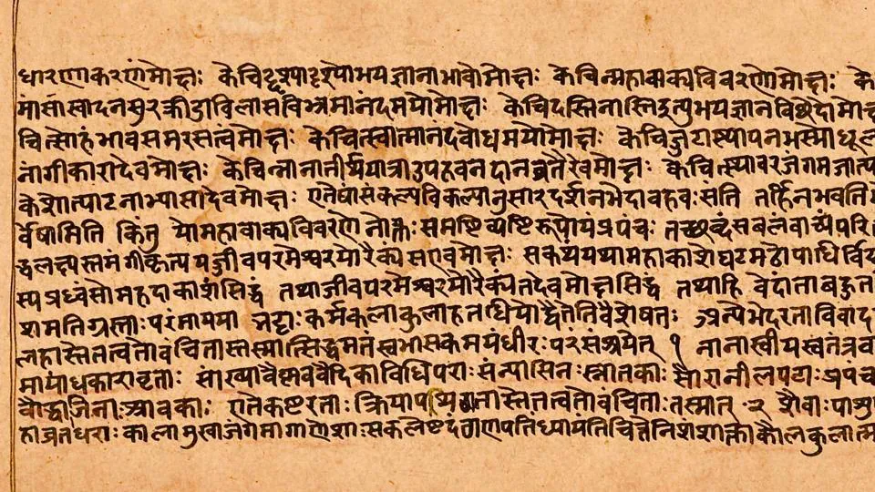

  

##### *Sanskrit.* *The alphabet is called 'Devanagari' - from the realm of the Gods.*
 

<body style="background-color:LightYellow;"></body>

<h1 align="center"> Experience Sampling Methodology (ESM) Study </h1>

## Contents

 
 
