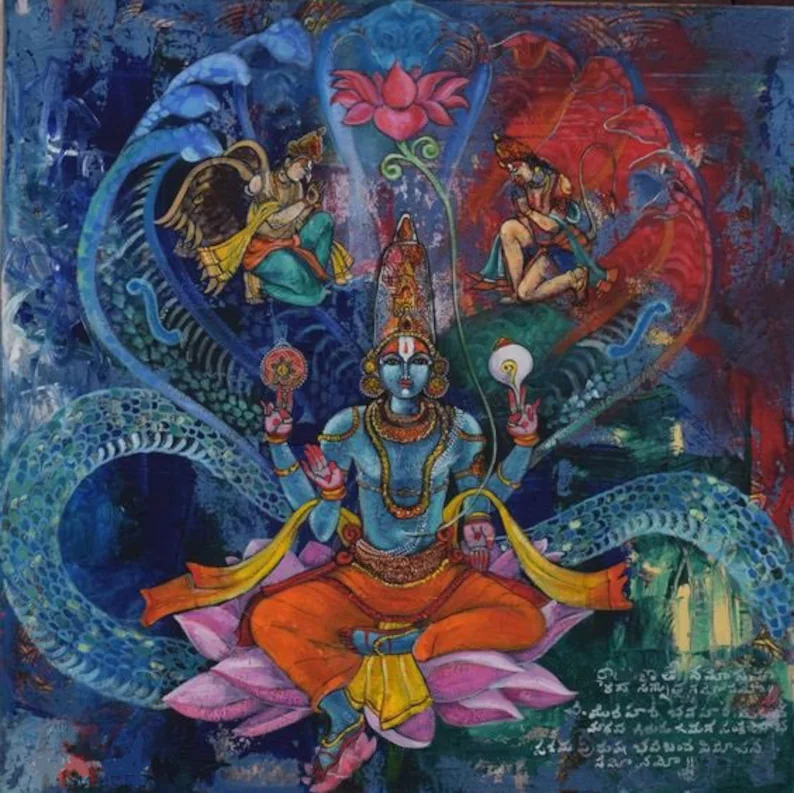

  

###### *Vishnu in His abode.*  

<h1 align="center"> Outreach </h1>

## Contents
1. [Reading Scholars](outreach.md#reading-scholars) 
2. [St. Joseph's College](outreach.md#st-josephs-college) 
3. [Bulmershe School](outreach.md#bulmershe-school) 
4. [Psychology Taster Session](outreach.md#university-psychology-taster-session)

 

## Reading Scholars
The University of Reading seeks to increase the transition of high-achieving A-level students, from low income families, to university education. 
I used the opportunity of giving talks to the 2021/22 cohort of scholars to gain data for the [online task](task.md) and the [ESM study](esm1.md). 

 

### - 31st March 2022: Presentation.
I gave an hour-long on-campus presentation, outlining the two studies that I am running, the aims of the NRG lab and how the students (~30) could get involved.
 
Regarding the lattermost point, I asked them to fill out an online survey which collected self-reported clinical data, containing the scales: [BDI](https://www.ismanet.org/doctoryourspirit/pdfs/Beck-Depression-Inventory-BDI.pdf), [MFQ](https://devepi.duhs.duke.edu/files/2018/03/MFQ-Adult-Self-Report-Long.pdf), [ASA](https://psycnet.apa.org/record/2021-31031-001), [SHAPS](https://www.ncbi.nlm.nih.gov/pmc/articles/PMC2957191/), [TEPS](http://citeseerx.ist.psu.edu/viewdoc/download?doi=10.1.1.379.8517&rep=rep1&type=pdf) and [STAI-trait anxiety scale](https://oml.eular.org/sysModules/obxOML/docs/id_150/State-Trait-Anxiety-Inventory.pdf). These were collected **prior** to the presentation, because the plan was to get them to do the task during the 2-hour evening session. 
 
However, I cancelled it because Prof. McCabe's previous experience showed that participants start talking to each other a few trials into the task. Therefore, I sent links to the task and unique identifying numbers to the scholars via email, after the presentation, so they may complete it in their own time. 
 
 
**TL;DR:** **Bad idea** to allow participants to do the task in their own time. A total of 23 scholars had completed the online survey, whereas just 9 of them did the task. A task-completion rate of **less than 1 in 3** makes this method of data collection **cumbersome and pointless** - the worst of both worlds. So, it should be used as the last resort.

 

### - 5th-7th July 2022: Summer Residential.

 
 

## St. Joseph's College

### - 30th June 2022: Presentation.

 
 

## Bulmershe School 

 
 

## University Psychology Taster Session

 
 

  
