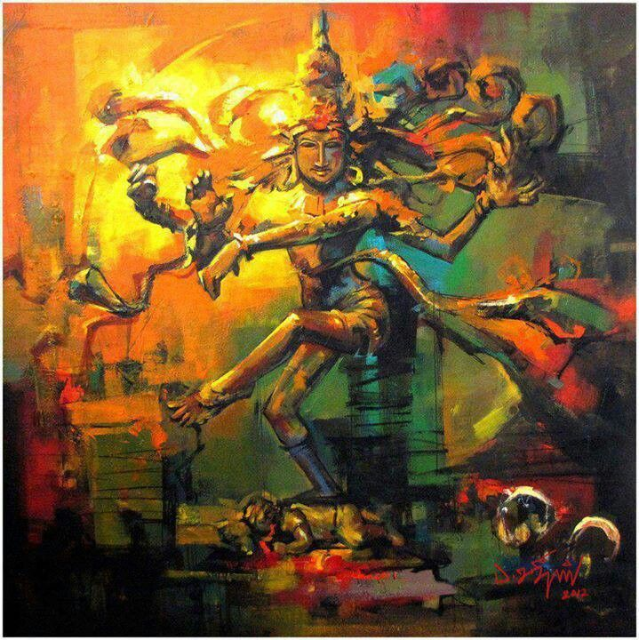
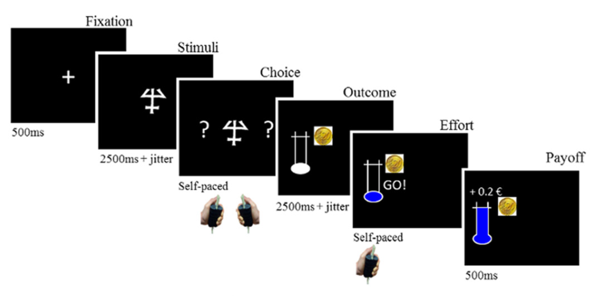

  

###### *Nataraja.* *The cosmic dancer. Stillness and chaos embodied.*
 

<h1 align="center"> Reward vs. Effort Learning Task </h1>

## Contents
1. [Design](task.md#design) 
2. [Recruitment](task.md#recruitment) 
3. [Analyses](task.md#analyses) 

 

## Design
#### Maximizing Reward & Minimizing Effort
A probabilistic task containing both effort and reward elements had been developed by [Skvortsova et al. (2014)](https://doi.org/10.1523/JNEUROSCI.1350-14.2014).
 
 

 
 

##### Figure 1: 
<i>The layout of the task designed by Skvortsova et al., taken from Fig. 1A of their paper.</i>

 
 

The task layout included a reward element associated with required effort (Outcome, Fig. 1). The 'effort' stage, once completed, leads to 'payoff' of the reward.
 

The team divided the reward and effort elements into **high** and **low** magnitudes. 10 and 20cents were used as monetary reward, while the effort calibrations required more work. The task invovled physical effort, measured by the force with which participants squeezed a tube with each hand. Initially, participants would exert maximum effort 4 times, where 100% effort was an average of the 4. Then, the **20%** and **80%** of max were defined as the low and high effort paradigms, respectively.

 

The probabilistic learning element was then introduced at the 'choice' stage of the task. Participants were to choose one of two shapes, each probabilistically associated with the **better** option of either the reward or effort element.  

For example, both shapes may lead to the **high effort** but only left one leads to **high reward** (the better outcome); the team called this the **'reward learning'** paradigm. 
<!-- Explain what reward learning means. If it were a block design, the participant would figure out that only the rewards change, not the effort. Therefore, the strategy the design involves trying to achieve the high reward; reward is given **salience**. -->

 
 

## Recruitment
#### Strategy

 
 

## Analyses

 
 
